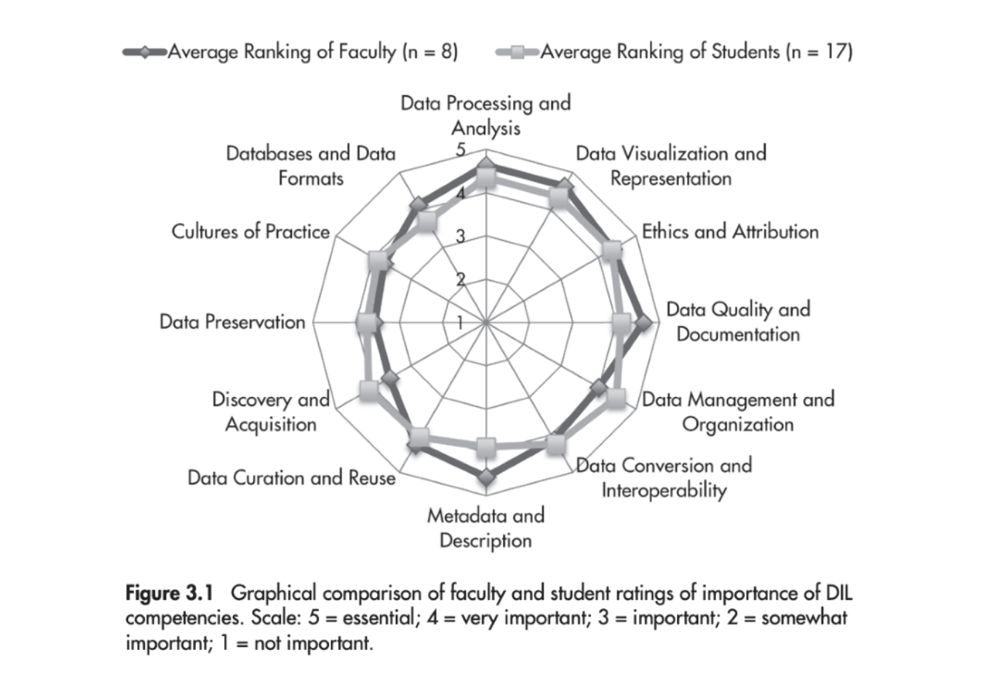

# Data Information Literacy Core Competencies

## Source

DATA INFORMATION LITERACY Librarians, Data, and the Education of a New Generation of Researchers edited by Jake Carlson and Lisa R. Johnston, Purdue U Press (2015) 
https://docs.lib.purdue.edu/cgi/viewcontent.cgi?article=1042&context=purduepress_ebooks

## Twelve Competencies and associated skills

### Cultures of Practice 

- Recognizes the practices, values, and norms of chosen field, discipline, or subdiscipline as they relate to managing, sharing, curating, and preserving data 

- Recognizes relevant data standards of field (e.g., metadata, quality, formatting) and understands how these standards are applied 

### Data Conversion and Interoperability 

- Is proficient in migrating data from one format to another 

- Understands the risks and potential loss or corruption of information caused by changing data formats 

- Understands the benefits of making data available in standard formats to facilitate downstream use 

### Data Curation and Reuse 

- Recognizes that data may have value beyond the original purpose, to validate research, or for use by others 

- Is able to distinguish which elements of a data set are likely to have future value for self and for others 

- Understands that curating data is a complex, often costly endeavor that is nonetheless vital to community-driven e-research 

- Recognizes that data must be prepared for its eventual curation at its creation and throughout its life cycle 

- Articulates the planning and activities needed to enable data curation, both generally and within local practice 

- Understands how to cite data as well as how to make data citable 

### Data Management and Organization 

- Understands the life cycle of data, develops data management plans, and keeps track of the relation of subsets or processed data to the original data sets 

- Creates standard operating procedures for data management and documentation 

### Data Preservation 

- Recognizes the benefits and costs of data preservation 

- Understands the technology, resources, and organizational components of preserving data 

- Utilizes best practices in preparing data for its eventual preservation during its active life cycle 

- Articulates the potential long-term value of own data for self or others and is able to determine an appropriate preservation time frame 

- Understands the need to develop preservation policies and is able to identify the core elements of such policies 

### Data Processing and Analysis 

- Familiar with the basic data processing and analysis tools and techniques of the discipline or research area 

- Understands the effect that these tools may have on the data 

- Uses appropriate workflow management tools to automate repetitive analysis of data 

### Data Quality and Documentation 

- Recognizes, documents, and resolves any apparent artifacts, incompletion, or corruption of data 

- Utilizes metadata to facilitate an understanding of potential problems with data sets 

- Documents data sufficiently to enable reproduction of research results and data by others 

- Tracks data provenance and clearly delineates and denotes versions of a data set 

### Data Visualization and Representation 

- Proficiently uses basic visualization tools of discipline 

- Avoids misleading or ambiguous representations when presenting data in tables, charts, and diagrams 

- Chooses the appropriate type of visualization, such as maps, graphs, animations, or videos, on the basis of an understanding of the reason/purpose for visualizing or displaying data 

### Databases and Data Formats 

- Understands the concept of relational databases and how to query those databases 

- Becomes familiar with standard data formats and types for discipline 

- Understands which formats and data types are appropriate for different research questions 

### Discovery and Acquisition of Data 

- Locates and utilizes disciplinary data repositories 

- Evaluates the quality of the data available from external sources 

- Not only identifies appropriate external data sources, but also imports data and converts it when necessary so it can be used locally 

### Ethics and Attribution 

- Develops an understanding of intellectual property, privacy and confidentiality issues, and the ethos of the discipline when it comes to sharing and administering data  

- Acknowledges data from external sources appropriately  

- Avoids misleading or ambiguous representations when presenting data 

- Metadata and Data Description 

- Understands the rationale for metadata and proficiently annotates and describes data so it can be understood and used by self and others  

- Develops the ability to read and interpret metadata from external disciplinary sources  

- Understands the structure and purpose of ontologies in facilitating better sharing of data 

 